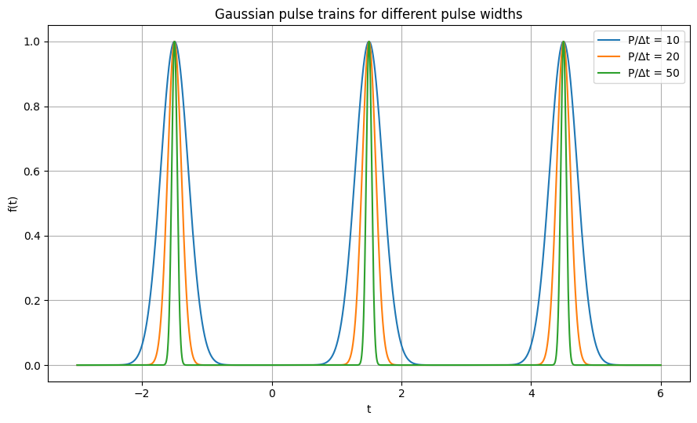

#Fourier Series Approximation of Gaussian Pulse Trains

## Introduction

This project explores the numerical approximation of Gaussian pulse trains using Fourier series.

The main objective is to analyze how the number of Fourier terms required for an accurate reconstruction depends on the ratio:

P / delta_t

where:

- P is the signal period
- delta_t is the width of the Gaussian pulse

The study focuses on time-domain reconstruction and error analysis.

---

## Fourier series approximation

The Fourier series coefficients are computed numerically, and the reconstructed signal is compared with the original Gaussian pulse train.

### Observations

- For a fixed period, narrower Gaussian pulses require more Fourier terms.
- The approximation improves as higher-order harmonics are included.
- The number of required terms is mainly controlled by the ratio P / delta_t.


---

## Error evolution with Fourier terms

The approximation error is evaluated as the number of Fourier terms increases.

The script computes:

- Maximum absolute error
- Mean squared error
- Relative L2 error


The error decreases as more terms are added, showing the convergence of the Fourier approximation.

---

## Influence of pulse width

Gaussian pulse trains with different widths are compared to visualize the effect of the ratio P / delta_t.



Narrower pulses are more localized in time and therefore require more Fourier components to be accurately reconstructed.

---

## Error comparison for different ratios

The convergence behavior is also compared for different values of P / delta_t.


As P / delta_t increases, the Gaussian pulses become narrower and the Fourier approximation requires more terms to reach a similar error level.

---

## Empirical result

The numerical experiments suggest the following approximate relationship:

m approx P / (2 * delta_t)

where m is the number of Fourier terms required for a good approximation.

Example values:

| P / delta_t | Required Fourier terms |
|------------:|----------------------:|
| 10          | 5                     |
| 20          | 10                    |
| 30          | 15                    |
| 40          | 20                    |
| 50          | 25                    |

---

## Usage

Install the required dependencies:

```bash
pip install numpy scipy matplotlib
